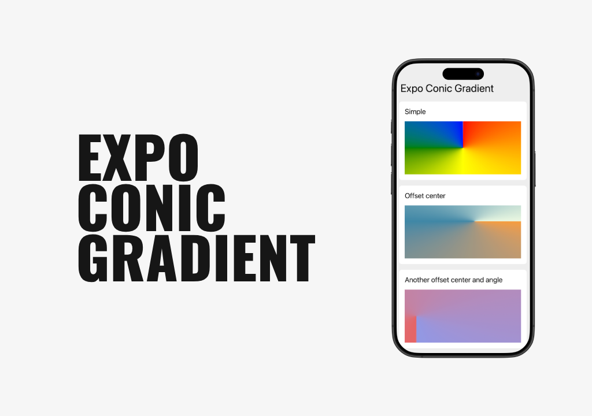

# expo-conic-gradient



## 🪄 Installation

```sh
yarn add expo-conic-gradient
```

## 📖 Usage

```tsx
import { ConicGradientView } from "expo-conic-gradient";

export default () => {
  return (
      <ConicGradientView
        colors={["red", "orange", "yellow", "green", "blue"]}
      />
  );
};
```


## ⚖️ License

**[MIT](/LICENSE)**

### Made with ♥️ by Jakub Grzywacz
