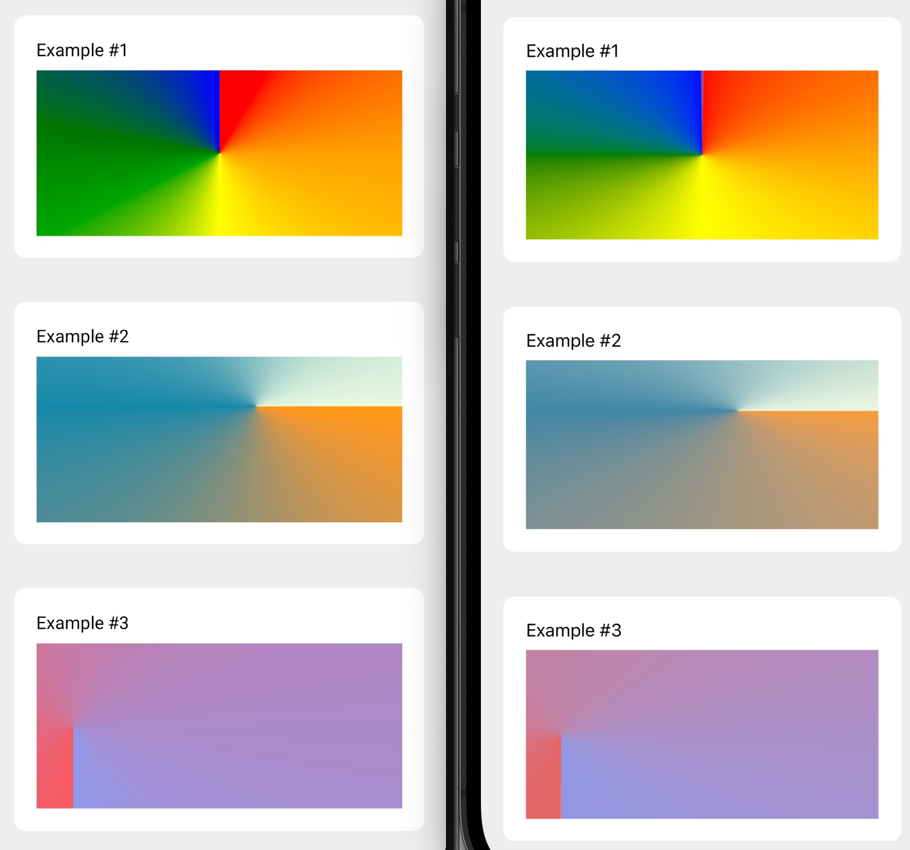

# expo-conic-gradient

> [!WARNING]  
> This library is still in the experimental stage and is not yet ready for production use.



## 🪄 Installation

```sh
yarn add expo-conic-gradient
```

<!-- ## 📖 Usage


## 🛠️ Troubleshooting -->


## ⚖️ License

**[MIT](/LICENSE)**

## 📝 Contribute

See the [contributing guide](CONTRIBUTING.md) to learn how to contribute to the repository and the development workflow.


### Built with ♥️ by Jakub Grzywacz
